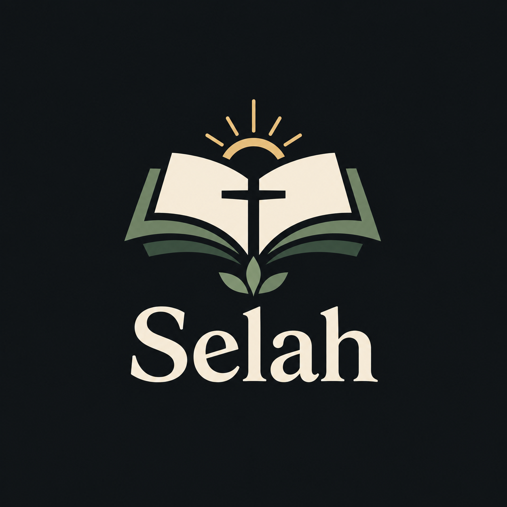

<div align="center">
  

  # Selah

  **Pause. Reflect. Write. Grow.**

  *A quiet place to write, reflect, and grow in faith.*
</div>

---

Selah is a work-in-progress, local-first journaling and note-taking app inspired by the flexibility of Notion and the personal knowledge approach of Obsidian. It is being built as a calm space for daily journaling, prayer, Scripture study, dreams, testimonies, and the thoughts and moments worth keeping.

> “Be still, and know that I am God.” — Psalm 46:10

## 🌿 The vision

Selah aims to bring together a flexible writing experience, personal organization, and faith-centered reflection without making note management feel like a chore.

- **Flexible writing:** a block-based editor for more than plain text.
- **Personal journals:** a home for daily entries, prayer, dreams, Bible study, testimonies, and miscellaneous notes.
- **Local-first philosophy:** prioritize personal ownership and control of your writing.
- **Selah documents (`.selah`):** a purpose-built file format inspired by Markdown's readability, with room for richer document structures and features.
- **Calm interface:** a minimal workspace designed to help you focus on what you want to write.

## 🗂️ The `.selah` file format

Selah uses its own **`.selah` document format**. It takes inspiration from Markdown, but it is intended to support richer content and structures than standard Markdown alone. This lets Selah evolve its document capabilities while keeping the format centered around the needs of the app.

`.selah` is not simply another extension for a Markdown file. Compatibility, import/export options, and the exact format specification should be documented as those capabilities are finalized. Until then, do not assume `.selah` files can be opened losslessly in other Markdown editors.

## ✨ Features and development goals

Selah is in active development. The list below describes the project's direction; not every item is necessarily implemented or production-ready.

- Daily journaling and browsing past entries
- Multiple kinds of notes, including prayer journals, dream journals, Scripture study, and testimonies
- A block-based rich-text editor
- Richer document content beyond plain Markdown
- Images and other media in entries
- Flexible organization for personal notes
- Local-first storage and data ownership
- A cohesive, faith-centered visual identity

## 🖼️ Screenshots

Screenshots of the live application will be added here as the interface stabilizes. The images should show the real app, not mockups.

soon to be added

<!--
To add screenshots, save genuine app captures in the screenshots/ directory, then uncomment and update this example:

<div align="center">
  
  <p><em>Selah's main workspace</em></p>
</div>
-->

## 🛠️ Built with

- [Tauri 2](https://v2.tauri.app/) — desktop application framework
- [React](https://react.dev/) and [TypeScript](https://www.typescriptlang.org/) — user interface and application logic
- [Vite](https://vite.dev/) — frontend development and build tooling
- [BlockNote](https://www.blocknotejs.org/) — block-based editor components
- [Tiptap](https://tiptap.dev/) — rich-text editing extensions
- [Tailwind CSS](https://tailwindcss.com/) — styling

## 🚧 Project status

**Early development — not yet production-ready.**

Selah is a personal project that is being actively developed. Features, the `.selah` format, and the interface may change. The current focus is building a dependable foundation for creating, editing, and saving notes before treating the app as a daily-use journal.

Please keep backups of important writing while the app and file format are still evolving.

## 💻 Getting started

These instructions are for running the project in development mode.

### Prerequisites

- Node.js and npm
- Rust and Cargo
- The platform-specific system dependencies required by [Tauri 2](https://v2.tauri.app/start/prerequisites/)

### Run locally

```bash
git clone https://github.com/El3ctricFX/Selah.git
cd Selah
npm install
npm run tauri dev
```

To run only the frontend development server:

```bash
npm run dev
```

To type-check and build the frontend:

```bash
npm run build
```

A successful build does not necessarily mean every app feature is implemented or ready for everyday use.

## 🤍 Why “Selah”?

*Selah* appears throughout the Psalms and other poetic passages of Scripture. Its exact meaning is debated, but it is often associated with a pause or moment of reflection. That idea captures the heart of the project: making room to slow down, write honestly, reflect on Scripture, and remember meaningful moments.

## 💬 Feedback

Selah is still taking shape. Suggestions and bug reports are welcome through [GitHub Issues](https://github.com/El3ctricFX/Selah/issues).

---

<div align="center">
  <em>Selah — Pause. Reflect. Write. Grow.</em>
</div>
